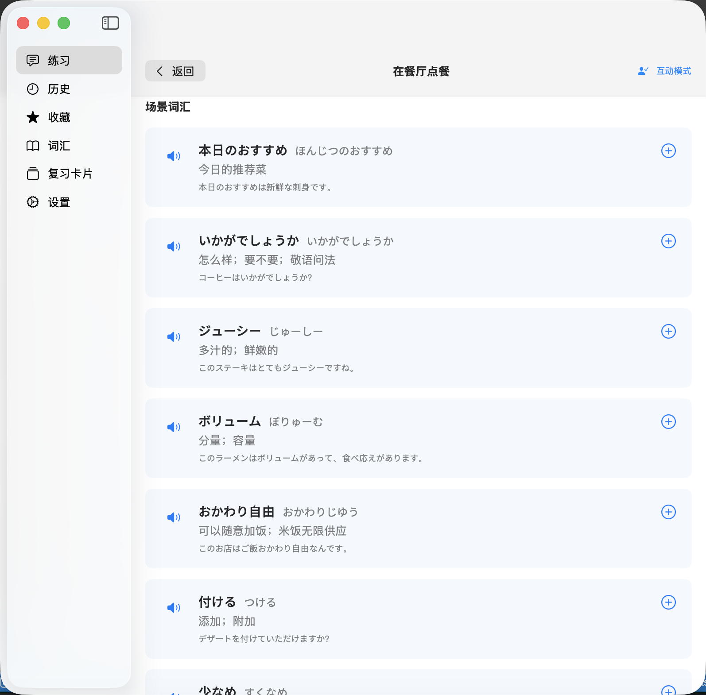

# AI-Kotoba (AI言葉)

> A macOS app for Chinese speakers learning Japanese through AI-generated scenario conversations.
>
> 专为中国日语学习者设计的 macOS 原生应用，通过 AI 生成的场景对话学日语。


**[English](#features) · [中文](#功能特点)**

---

## Screenshots

> 📸 *Screenshots coming soon*

| Practice | Interactive Mode | Flashcards |
|----------|-----------------|------------|
|  |  |  |

---

## Features

AI-Kotoba generates natural, contextual Japanese conversations from any scenario you describe, paired with Chinese translations and native TTS pronunciation. Built natively for macOS using SwiftUI and SwiftData.

### AI Scenario Generation
Describe any real-world scenario and get a natural Japanese conversation with Chinese translations. The app uses a **two-turn prompting strategy** — first generating monolingual Japanese for naturalness, then translating — avoiding the unnatural expressions that come from bilingual code-switching.

### Interactive Role-Play
Practice by playing one side of the conversation yourself. Choose to be Person A, Person B, or both. Use **speech-to-text** to speak your Japanese responses aloud, and get AI feedback on how you did.

### TTS Pronunciation
Click any dialogue line to hear it read aloud in Japanese using macOS's built-in speech synthesis.

### Vocabulary Management
Save vocabulary words from conversations to a personal list with word, reading (furigana), meaning, and example sentences. Search and edit your collection any time.

### Spaced Repetition Flashcards
Review your vocabulary using the **SM-2 algorithm** (the same one used by Anki). The app schedules reviews based on how well you remember each word, spending more time on difficult material.

### History & Favorites
The app auto-saves your last 100 scenarios. Star any scenario to add it to Favorites — favorited scenarios are never auto-deleted and always keep their vocabulary list.

---

## Requirements

- macOS 14 (Sonoma) or later
- Xcode 15 or later
- An [Anthropic Claude](https://console.anthropic.com/settings/keys) or [OpenAI](https://platform.openai.com/api-keys) API key

---

## Getting Started

```bash
git clone https://github.com/yourusername/AI-Kotoba.git
cd AI-Kotoba
open AI-Kotoba.xcodeproj
```

Press **Cmd+R** to build and run. On first launch, enter your API key in Settings — it's stored securely in the macOS Keychain.

---

## Tech Stack

| Layer | Technology |
|-------|-----------|
| UI | SwiftUI (macOS 14+) |
| Persistence | SwiftData |
| State Management | `@Observable` (Swift 5.9) |
| AI Generation | Anthropic Claude API / OpenAI API |
| Speech-to-Text | Apple Speech framework (`ja-JP`) |
| Text-to-Speech | AVSpeechSynthesizer |
| SRS Algorithm | SM-2 (SuperMemo) |
| API Key Storage | macOS Keychain |

---

## Privacy

All data is stored locally on your Mac. Your API key is stored in the macOS Keychain and never leaves your device. The app makes no external network requests except to the AI API you configure.

---

## License

MIT — see [LICENSE](LICENSE) for details.

---
---

## 功能特点

AI-Kotoba 根据你描述的任意场景生成自然地道的日语对话，并附有中文翻译和真人发音朗读。使用 SwiftUI 和 SwiftData 原生构建于 macOS 平台。

### AI 场景对话生成
输入任意现实场景，即可获得带中文翻译的自然日语对话。应用采用**两轮提示策略**——先用纯日语生成自然对话，再翻译为中文——有效避免了双语混合带来的不自然表达。

### 互动角色扮演
选择扮演对话中的一个角色（A、B 或两者）进行练习。支持**语音输入**，直接开口说日语，并获得 AI 对你回答的即时反馈。

### 发音朗读
点击任意对话行，即可通过 macOS 系统语音听到标准日语发音。

### 词汇管理
将对话中的词汇保存到个人词汇表，包含单词、读音（假名）、中文释义和例句，随时搜索和编辑。

### 间隔重复复习卡片
使用 **SM-2 算法**（与 Anki 相同）复习词汇。应用根据记忆情况智能安排复习时间，将更多精力放在难记的内容上。

### 历史记录与收藏
自动保存最近 100 个场景。给喜欢的场景加星收藏——收藏的场景永不自动删除，且始终保留对应词汇列表。

---

## 环境要求

- macOS 14 (Sonoma) 或更高版本
- Xcode 15 或更高版本
- [Anthropic Claude](https://console.anthropic.com/settings/keys) 或 [OpenAI](https://platform.openai.com/api-keys) API 密钥

---

## 快速开始

```bash
git clone https://github.com/yourusername/AI-Kotoba.git
cd AI-Kotoba
open AI-Kotoba.xcodeproj
```

按 **Cmd+R** 构建并运行。首次启动时在设置中输入 API 密钥——密钥将安全存储在 macOS 钥匙串中。

---

## 数据隐私

所有数据均存储在本地 Mac 上。API 密钥保存在 macOS 钥匙串中，永不离开你的设备。除了向你配置的 AI API 发送请求外，应用不进行任何外部网络通信。

---

## 许可证

MIT — 详见 [LICENSE](LICENSE)。
